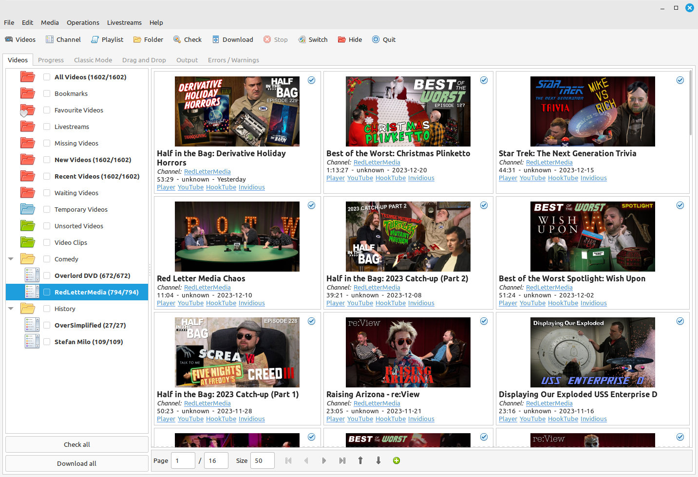
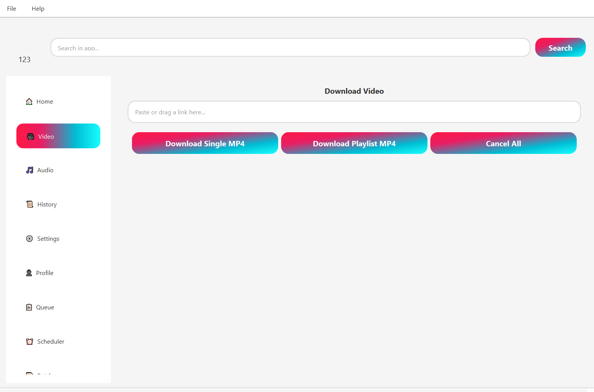
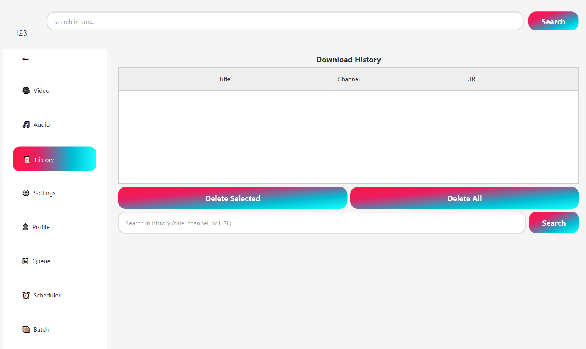

# Saverly — The AI-Powered YouTube Downloader for Windows & Mac
 
**Saverly is a free, open-source YouTube downloader that also works with Twitch, Odysee, Vimeo, TikTok, and 1000+ other sites — and it's the first one with a built-in AI assistant.** Paste any video link and Saverly downloads it in up to 4K, generates a full transcript, writes a chapter-by-chapter summary, and lets you search inside the video in plain English. No subscriptions, no bundled ads, no telemetry, no Python or terminal required. One-click installer for Windows and Mac, everything bundled — yt-dlp, FFmpeg, the AI model — double-click and it works.
 

 
[Install](#-install) · [Features](#-features--download-transcribe-summarize) · [AI Assistant](#how-ai-video-transcription-and-summary-works) · [Comparison](#comparison-with-other-youtube-downloaders) · [Supported Sites](#supported-sites--1000-platforms) · [FAQ](#frequently-asked-questions) · [Roadmap](#roadmap)
 
---
 
## ❓ Why use Saverly instead of other YouTube downloaders
 
Most video downloaders in 2026 fall into two broken categories. On one side: paid apps that charge $30–$60 a year, lock high-definition downloads behind a subscription, push promotional popups from the system tray, and rarely add anything genuinely new. On the other: powerful open-source tools like Tartube, yt-dlp, and youtube-dl that do the job but require virtual environments, package manager installs, manual DLL copying, and terminal commands that scare off most regular users.
 
Saverly is the middle path. The feature set of a premium YouTube video downloader, the one-click install of a consumer app, and a new layer neither side offers — an AI assistant that turns a downloaded video into something you can actually work with. A transcript you can copy into a document. A summary that tells you whether a two-hour podcast is worth your time. A search box that jumps you to the exact minute someone mentioned the thing you care about.
 
**What you get:**
 
- **100% free** — no trial limits, no premium tier, no hidden subscriptions, no feature paywalls
- **100% private** — zero analytics, zero telemetry, zero tracking, no account required
- **100% native** — one-click installer for Windows and Mac, all dependencies bundled
- **100% open source** — MIT licensed, auditable source code
- **AI transcription, summary, and chapter generation** — runs locally, works offline
- **1000+ supported sites** — YouTube, Twitch, Odysee, Vimeo, TikTok, BitChute, SoundCloud, Dailymotion, and hundreds more
- **Up to 4K, 8K, and HDR** — full quality where the source provides it
- **YouTube playlists, channels, and live streams** — subscribe and auto-download new uploads

## 📦 Install
 
### Windows
 
Download `Saverly-Setup.exe` from the [latest release](../../releases/latest) and double-click it. The installer is digitally signed, so Windows SmartScreen lets it through without warnings. Every dependency — yt-dlp, FFmpeg, the local AI model — is bundled inside. No Python, no MSYS2, no terminal, no manual DLL copying. Takes about a minute and Saverly is ready to use.
 
### Mac
 
Download `Saverly.dmg` from the [latest release](../../releases/latest), open it, and drag Saverly to your Applications folder. Signed and notarized with an Apple Developer ID, so it opens without Gatekeeper warnings. Universal binary — runs natively on Apple Silicon (M1 through M5) and Intel Macs. All dependencies bundled.
 
### Linux
 
Linux packaging is on the v1.1 roadmap — `.deb`, `.rpm`, AppImage, and Flatpak. If you want to run Saverly on Linux today, the source builds against any distribution with Node 20+ and Rust 1.75+. Follow the build instructions in [BUILDING.md](BUILDING.md).
 
## ✨ Features — download, transcribe, summarize
 
### Video download
 
- **1000+ supported sites** — YouTube, Twitch, Odysee, Vimeo, TikTok, Instagram, Facebook, BitChute, SoundCloud, Dailymotion, Reddit, Bilibili, Rumble, and hundreds more
- **Up to 4K, 8K, and HDR** video where the source provides it
- **Download YouTube playlists** with one click — all videos, or filtered by duration, upload date, or resolution
- **Subscribe to YouTube channels** — Saverly checks automatically and downloads new uploads on a schedule you choose
- **Download YouTube live streams** in real time with streamlink support
- **Download multiple videos in parallel** with a configurable queue and bandwidth limits
- **Resume interrupted downloads** from where they left off
- **Smart dedup** — when the same creator uploads a video to both YouTube and Odysee, Saverly detects it and doesn't download twice
### Audio extraction & conversion
 
- **YouTube to MP3** at any bitrate up to 320 kbps, with metadata and cover art embedded automatically
- **Extract audio in M4A, WAV, FLAC, OGG** — your choice of format and quality
- **Podcast mode** — convert a YouTube channel into a local podcast-style folder structure
- **Generate RSS feed** from any subscribed channel so you can listen in your favorite podcast app *(v1.1)*
### Subtitles & captions
 
- **Download YouTube subtitles** in any available language
- **Download auto-generated captions** where human-written subtitles are missing
- **Burn subtitles into video** on export *(optional)*
- **Download entire playlist subtitles** as a batch
### AI layer (this is where Saverly is different)
 
- **Automatic transcription** of every downloaded video using Whisper — generates `.srt`, `.vtt`, and `.txt` files
- **Chapter-by-chapter summary** — if the creator didn't add chapters, Saverly generates them and writes a summary for each
- **Full-video TL;DR** — one-paragraph summary of a two-hour podcast so you can decide if it's worth watching
- **Natural-language search** across your library — ask *"which of my saved videos talked about the Nvidia earnings"* and get exact timestamps
- **Q&A with video content** — ask questions about a specific video and get answers with timestamps *(v1.1)*
- **Smart highlights** — automatically extract the most interesting 30–60 second clips for short-form repurposing *(v1.1)*
### Quality-of-life
 
- **SponsorBlock integration** — skip or cut out sponsor segments, intros, outros, and self-promotion automatically
- **Video clip extraction** — cut a specific time range during download, no separate editing needed
- **Scheduled downloads** — hourly, daily, weekly, or custom cron-style schedules
- **Classic mode** — a simplified paste-URL-and-click interface for one-off downloads
- **Menu bar / system tray** quick-add from any browser
- **Browser extension** for Chrome, Firefox, and Edge — one-click save directly from YouTube pages *(v1.1)*
## How AI video transcription and summary works
 
Saverly's AI features are **on by default but fully controllable**. You can disable the entire AI layer in Settings if you only want a classical video downloader.
 
### Two modes
 
**Local mode (default, recommended).** Saverly bundles Whisper for transcription and a small local language model (via Ollama on Linux/Mac, llama.cpp on Windows) for summaries and natural-language search. Nothing ever leaves your computer. Works fully offline. Requires about 4 GB of free RAM and around 3 GB of disk space for the bundled models. Benefits from a recent GPU but doesn't require one — CPU-only works fine, just slower.
 
**API mode (optional).** If you want faster or higher-quality AI processing, plug in your own API key from OpenAI, Anthropic, Google, or any OpenAI-compatible provider. Requests go directly from your machine to your chosen provider — Saverly operates no intermediary server. You control quota, you pay the provider directly (or not — several providers offer generous free tiers as of 2026).
 
### What the AI actually does
 
- **Transcription.** Every downloaded video is automatically transcribed. You get `.srt` for video players, `.vtt` for the web, and `.txt` for copying into documents. Timestamps included.
- **Summaries.** One-paragraph TL;DR at the top. Then chapter-by-chapter breakdown with approximate timestamps, so you can skim a two-hour video in three minutes.
- **Search.** Type a natural-language query in the Library search bar — Saverly searches across every transcript in your collection and returns specific videos with specific timestamps. *"What did I save about Apple's M5 launch"* works as a query.
- **Translation** *(v1.2)* — generate subtitles in a target language from any source transcript.
## Comparison with other YouTube downloaders
 
| Feature | Saverly | Tartube | 4K Video Downloader | yt-dlp | Stacher |
|---|---|---|---|---|---|
| Price | **Free** | Free | $15–$45 | Free | $25 |
| Open source | **Yes** | Yes | No | Yes | No |
| One-click install | **Yes** | No (MSYS2/venv hell) | Yes | No (CLI) | Yes |
| Modern native UI | **Yes** | No (GTK3, dated) | Yes | No (CLI only) | Yes |
| AI transcription | **Yes** | No | No | No | No |
| AI video summary | **Yes** | No | No | No | No |
| Natural-language search | **Yes** | No | No | No | No |
| YouTube playlist download | **Yes** | Yes | Yes (paid) | Yes | Yes |
| YouTube channel subscription | **Yes** | Yes | Yes (paid) | No | Yes |
| YouTube live stream download | **Yes** | Yes | No | Yes | Partial |
| 4K / 8K / HDR support | **Yes** | Yes | Paid tier | Yes | Yes |
| SponsorBlock integration | **Yes** | Yes | No | Yes | Partial |
| Audio extraction (MP3) | **Yes** | Yes | Yes | Yes | Yes |
| Subtitle download | **Yes** | Yes | Yes (paid) | Yes | Yes |
| Zero telemetry | **Yes** | Yes | No | Yes | Unknown |
| 1000+ site support | **Yes** | Yes | ~50 sites | Yes | Yes |
 
## Screenshots
 
| Homepage | Downloading YouTube playlist in 4K | History |
|---|---|---|
|  |  |  |
 
## Supported sites — 1000+ platforms
 
Saverly uses yt-dlp under the hood, which means every site yt-dlp supports, Saverly supports. That's over a thousand, including:
 
**Video platforms:** YouTube, Vimeo, Dailymotion, Odysee, Rumble, BitChute, PeerTube, Nebula, Floatplane
 
**Live streaming:** Twitch, Kick, YouTube Live, Trovo
 
**Social networks:** Instagram, TikTok, Facebook, Twitter/X, Reddit, LinkedIn, Pinterest
 
**Audio platforms:** SoundCloud, Bandcamp, Mixcloud
 
**Educational:** Coursera, Udemy (your own courses), TED, Khan Academy
 
**Regional:** Bilibili, Niconico, VK, Youku, iQiyi
 
**News & media:** BBC iPlayer, ARD, ZDF, France.tv, Al Jazeera, CNN
 
The [full list of 1000+ supported sites](https://github.com/yt-dlp/yt-dlp/blob/master/supportedsites.md) is maintained by the yt-dlp project.
 
## Safety & privacy
 
- **Zero telemetry.** Saverly makes no network calls at launch, during downloads, or during AI processing in local mode. Everything is verifiable with a firewall.
- **No account required.** No sign-up, no login, no email collection.
- **No bundled software.** The installer contains Saverly and its dependencies. No toolbars, no crypto miners, no "partner offers."
- **Signed installers** on both Windows (digital signature) and Mac (Apple Developer ID + notarization).
- **Open source.** Every line of code is in this repository. If you're security-conscious, build from source and verify the binary matches.
## Frequently Asked Questions
 
### Is Saverly a free YouTube downloader?
 
Yes. Saverly is 100% free, MIT licensed, with no premium tier, no in-app purchases, no paywalled features. If you want to support development, there's a GitHub Sponsors link — but nothing is locked behind it.
 
### How do I download YouTube videos on Windows?
 
Download `Saverly-Setup.exe` from the [latest release](../../releases/latest), double-click to install, open Saverly, paste the YouTube URL, and click Download. No configuration required, no Python, no terminal.
 
### How do I download YouTube videos on Mac?
 
Download `Saverly.dmg` from the [latest release](../../releases/latest), drag Saverly to Applications, open it, paste the YouTube link, and click Download. Works on both Apple Silicon and Intel Macs.
 
### Can I download YouTube playlists and entire channels?
 
Yes. Paste a playlist or channel URL and Saverly downloads every video. You can filter by duration, resolution, or upload date. You can also subscribe to a channel — Saverly will check on a schedule and automatically download new uploads.
 
### Can Saverly download YouTube videos in 4K or 8K?
 
Yes. If the source video is available in 4K, 8K, or HDR, Saverly downloads it in that quality. There's no paid tier that locks high resolution — everything is free.
 
### How do I convert a YouTube video to MP3?
 
In Saverly, paste the YouTube link, select "Audio only" in the format dropdown, choose MP3 and the bitrate you want, and click Download. Saverly automatically embeds the video's title, artist, and thumbnail as ID3 metadata.
 
### Can I download YouTube live streams?
 
Yes. Saverly detects YouTube, Twitch, and Odysee live streams automatically. You can start the download while the stream is running, and Saverly will keep recording until the stream ends.
 
### Does Saverly work with sites other than YouTube?
 
Yes. Over 1000 sites are supported via yt-dlp — including Twitch, Odysee, Vimeo, TikTok, Instagram, Facebook, Reddit, SoundCloud, Bandcamp, and hundreds more. See the supported sites section above.
 
### What's the difference between Saverly and Tartube?
 
Tartube is a powerful Python/GTK3 frontend for yt-dlp, but installation is notoriously complicated — on Windows it requires MSYS2 and manual DLL copying, on Mac it requires Homebrew, virtual environments, and pip, and the interface looks dated. Saverly has a modern native UI, a one-click installer with everything bundled, and adds an AI transcription and summary layer that Tartube does not have. If you're looking for a Tartube alternative with better installation and AI features, Saverly is that.
 
### What's the difference between Saverly and 4K Video Downloader?
 
4K Video Downloader is paid ($15–$45 depending on the tier) and locks high-resolution downloads, YouTube channel subscriptions, and some other features behind the paid tier. Saverly is 100% free, open source, and adds AI transcription, summary, and in-video search which 4K Video Downloader doesn't offer.
 
### Is Saverly a yt-dlp GUI?
 
Yes, Saverly uses yt-dlp as its download engine, so it supports every site yt-dlp supports. But Saverly goes far beyond a simple GUI — it adds AI-powered transcription, summary, chapter generation, library management, channel subscriptions, scheduled downloads, SponsorBlock integration, and a modern one-click-install experience.
 
### How does AI video transcription work in Saverly?
 
Saverly uses Whisper for transcription. By default, the model runs locally on your computer — nothing leaves your machine, works fully offline. You can optionally connect your own OpenAI or Anthropic API key if you want faster cloud-based processing. Every downloaded video automatically generates `.srt`, `.vtt`, and `.txt` files alongside the video itself.
 
### Does the AI send my videos or data anywhere?
 
In default (local) mode, no — everything stays on your computer. In optional API mode, Saverly sends the transcript (not the video file) to the provider you chose, using the API key you supplied. Saverly operates no server and receives no copy of your data in either mode.
 
### Can I download a YouTube video with its subtitles?
 
Yes. Saverly downloads subtitles in any available language alongside the video. If the creator didn't add human-written subtitles, Saverly can use YouTube's auto-generated captions. You can also generate your own transcript via the built-in AI, which often produces better quality than YouTube's auto-captions for non-English content.
 
### Is it legal to download YouTube videos?
 
The legality of video downloading depends on the source, the content, the purpose, and your local laws. Downloading your own content, Creative Commons licensed content, or public domain content is broadly uncontroversial. Downloading copyrighted content without permission for redistribution is not. US courts have generally found web scraping of publicly accessible content to be legal, but downloading may still violate a site's terms of service. Use Saverly responsibly — see the Disclaimer section below.
 
### Why doesn't Saverly have ads like other free downloaders?
 
Because we don't need them. Saverly is developed in the open and maintained by volunteers. There's no business model that requires monetizing users with popups, bundled software, or telemetry.
 
## Roadmap
 
**v1.1** — Linux packages (`.deb`, `.rpm`, AppImage, Flatpak). Q&A with video content. Smart highlights extraction for short-form content creators. Browser extension for Chrome, Firefox, and Edge. RSS podcast feed export. Mirror detection (fall back to Invidious / Piped / Odysee if YouTube takes a video down).
 
**v1.2** — Subtitle translation into any language. Library sync across devices via iCloud, Dropbox, or self-hosted WebDAV. Creator toolkit (split long videos into shorts, thumbnail grab, metadata export for YouTube Studio).
 
**v2.0** — Plugin system for third-party site extractors. Community rule marketplace for custom download profiles. Mobile companion app for iOS and Android (view library, queue downloads remotely).
 
See [open issues](../../issues) and [discussions](../../discussions) to vote or propose.
 
## Contributing
 
Contributions welcome — new site extractors, UI refinements, translations, bug fixes. Start with [CONTRIBUTING.md](CONTRIBUTING.md).
 
## License
 
MIT License. See [LICENSE](LICENSE).
 
## Disclaimer
 
Saverly is a tool for downloading videos from publicly accessible sources. It is intended for personal archival, educational use, downloading your own content, and working with content that is freely licensed or in the public domain. You are responsible for complying with the terms of service of the sites you download from and with copyright law in your jurisdiction. The authors and contributors of Saverly do not endorse or condone the use of this software for copyright infringement. Respect creators, respect licenses, and when in doubt, don't download.
 
---
 
**If Saverly saved you time or saved a video you cared about, please star the repo on GitHub.** It's the only metric we track.
